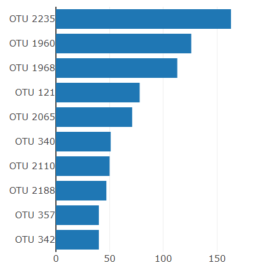
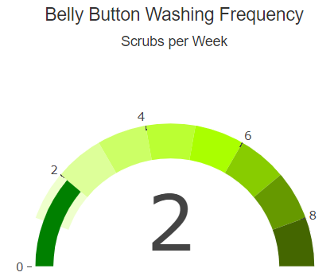
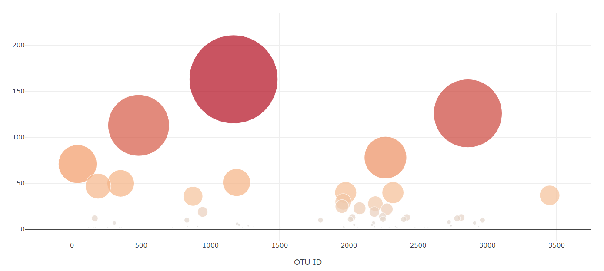

# plotly_deploy

## Background
A lab is researching the ability of a bacterial species that would be able to synthesize protein that tastes like beef.  The lab is partnered with company called ‘Improbable Beef’ to create a perfectly tasting beef tasting alternative.
The hypothesis is that this particular bacteria can be found in the human body.  Further hypothetically, the ideal bacteria may be found in the belly button of human body.
Participants in the study may have different bacteria dominating in their navel.  The test subjects have been given an ID number and have been kept anonymous.
Using the dataset analyzed by the lab, a website is created where the study participants can visit and enter their unique ID number to find out which bacteria are colonizing in their navel.
The website created was with the tools such as Javascript, Plotly and Bootstrap. The website created has a ID selection from a dropdown menu which will provide the following plots.

